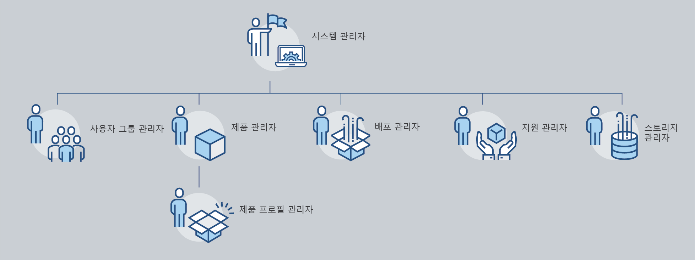
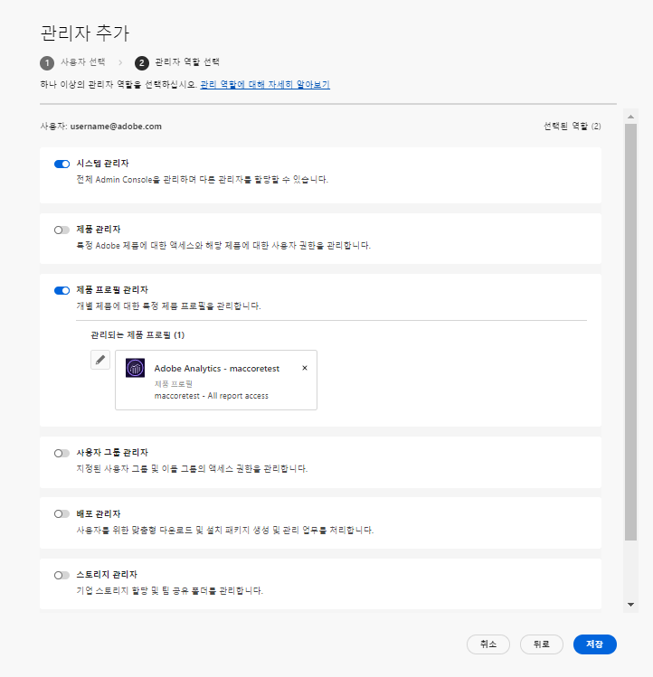
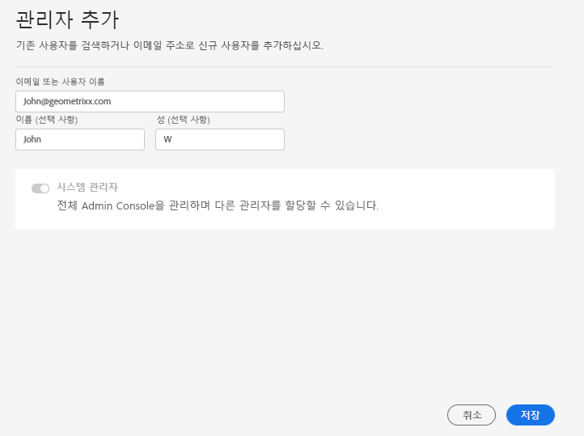
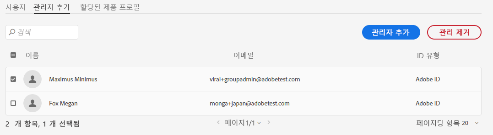

# 관리 역할

조직은 Adobe Admin Console을 사용하여 Adobe 제품 액세스 및 사용을 세밀하게 관리할 수 있는 유연한 관리 계층을 정의할 수 있습니다. 엔터프라이즈 온보딩 프로세스 중에 프로비저닝된 하나 이상의 시스템 관리자가 계층 구조의 맨 위에 있습니다. 이러한 시스템 관리자는 전반적인 제어를 유지하면서 다른 관리자에게 권한을 위임할 수 있습니다.

관리 역할은 기업에 다음과 같은 주요 이점을 제공합니다.

* 행정 책임 분권 통제
* 사용자 및 제품별 제품 지정에 대한 빠른 보기
* 제품 관리자에게 할당량을 할당하는 기능

## 관리 계층

적용 대상: Adobe 엔터프라이즈 고객.

관리 계층은 기업의 고유한 요구 사항에 맞게 사용할 수 있습니다. 예를 들어, 기업은 다른 관리자를 지정하여 Adobe Creative Cloud 및 Adobe Marketing Cloud 오퍼링에 대한 자격을 관리할 수 있습니다. 또는 기업에 다른 비즈니스 단위에 속하는 사용자의 자격을 관리할 다른 관리자가 있을 수 있습니다.

>[!NOTE]
>
>관리 계층은 팀 고객에게 적용되지 않습니다. 팀 고객은 단일 **시스템 관리자** 역할. 계약 소유자(_이전에&#x200B;**기본 관리자**_)은 계약 세부 사항 및 청구 내역에 액세스할 수 있는 시스템 관리자입니다. 현재 계약 소유자인 경우 기존 시스템 관리자(_&#x200B;이전에 **보조 관리자**_)를 계약 소유자로 지정합니다.

_관리자 역할 계층_

| 역할 | 설명 |
|--- |--- |
| **시스템 관리자** | 조직의 슈퍼 사용자 Admin Console에서 모든 관리 작업을 수행할 수 있습니다. 또한 다른 사용자에게 다음 관리 기능을 위임할 수 있는 권한이 있습니다. 제품 관리자, 제품 프로필 관리자, 사용자 그룹 관리자, 배포 관리자 및 지원 관리자. |
| **제품 관리자** | 해당 관리자에게 지정된 제품 및 다음과 같은 모든 관련 관리 기능을 관리합니다.<ul><li>제품 프로필 만들기</li><li>사용자 및 사용자 그룹을 조직에 추가하되 제거하지는 않습니다</li><li>제품 프로필에서 사용자 및 사용자 그룹 추가 또는 제거</li><li>제품 프로필에서 제품 프로필 관리자 추가 또는 제거</li><li>제품에서 다른 제품 관리자를 추가하거나 제거합니다</li><li>그룹에서 그룹 관리자 추가 또는 제거</li></ul> |
| **제품 프로필 관리** | 해당 관리자에게 지정된 제품 프로필 설명과 다음을 포함한 모든 관련 관리 기능을 관리합니다.<ul><li>사용자 및 사용자 그룹을 조직에 추가하되 제거하지는 않습니다</li><li>제품 프로필에서 사용자 및 사용자 그룹 추가 또는 제거</li><li>제품 프로필에서 사용자 및 사용자 그룹에 대한 제품 권한을 지정 또는 취소합니다</li><li>제품 프로필에 대한 사용자 및 사용자 그룹의 제품 역할 관리 |
| **사용자 그룹 관리자** | 해당 관리자에게 지정된 사용자 그룹 설명과 다음을 포함한 모든 관련 관리 기능을 관리합니다.<ul><li>그룹에서 사용자 추가 또는 제거</li><li>그룹에서 사용자 그룹 관리자 추가 또는 제거 |
| **배포 관리자** | 최종 사용자에 대한 소프트웨어 패키지 및 업데이트를 생성, 관리 및 배포합니다. |
| **지원 관리자** | 고객이 보고한 문제 보고서와 같이 지원 관련 정보에 액세스할 수 있는 비관리 역할입니다. |
| **스토리지 관리** | 조직의 스토리지 관리를 관리합니다. 관리자는 활성 사용자와 비활성 사용자 모두의 저장소 사용량을 보고 내용을 다른 수신자에게 전송할 수 있습니다. |

각 관리자 역할에 대한 권한 및 권한의 자세한 목록은 [권한](#enterprise-admins-permissions-matrix).

## Enterprise 관리자 역할 추가 {#add-enterprise-role}

적용 대상: Adobe 엔터프라이즈 고객.

관리자는 다른 사용자에게 관리자 역할을 할당하여 사용자와 동일한 권한을 부여하거나, 설명된 대로 계층에서 관리자 역할 아래에 있는 역할에 대한 권한을 부여할 수 있습니다 [위](#administrative-hierarchy). 예를 들어 제품 관리자는 사용자에게 제품 관리자 권한 또는 제품 프로필 관리자 권한을 부여할 수 있지만 배포 관리자 권한은 제공할 수 없습니다. Admin Console에 대한 권한은 [권한 매트릭스](#enterprise-admins-permissions-matrix).

관리자를 추가하거나 초대하려면:

1. 에서 [Admin Console](https://adminconsole.adobe.com/), 선택 **사용자** > **관리자**.

   또는 관련 제품, 제품 프로필 또는 사용자 그룹으로 이동하여 **관리자** 탭.

1. 클릭 **관리자 추가**.
1. 이름 또는 이메일 주소를 입력합니다. 유효한 이메일 주소를 지정하고 화면에 정보를 입력하여 기존 사용자를 검색하거나 새 사용자를 추가할 수 있습니다.
1. 클릭 **다음**. 관리자 역할 목록이 표시됩니다.

>[!NOTE]
>
>* 이 화면의 옵션은 계정 및 관리자 역할에 따라 다릅니다. 보유하고 있는 것과 동일한 권한을 제공하거나 계층에서 사용자 역할에 대한 권한을 부여할 수 있습니다.
>* 팀의 시스템 관리자는 다음의 한 가지 관리 역할만 할당할 수 있습니다. 시스템 관리자.

1. 관리자 역할을 하나 이상 선택합니다.
1. 제품 관리자, 제품 프로필 관리자 및 사용자 그룹 관리자와 같은 관리 유형에 대해 각각 특정 제품, 프로필 및 그룹을 선택합니다.

>[!NOTE]
>
>제품 프로필 관리자의 경우 두 개 이상의 제품에 대한 프로필을 포함할 수 있습니다.

1. 사용자에게 할당된 관리자 역할을 검토하고 **저장**.

사용자는 `message@adobe.com`.

사용자가 **시작** 을 입력하여 조직에 참여합니다. 새 관리자가 **시작** 이메일 초대를 받으면 Admin Console에 로그인할 수 없습니다.

로그인 프로세스의 일부로, 사용자에게 아직 Adobe 프로필이 없는 경우 프로필 설정을 요청받을 수 있습니다. 사용자에게 이메일 주소와 연결된 프로필이 여러 개 있는 경우, 사용자는 &quot;팀 가입&quot;(메시지가 표시되면)을 선택한 다음 새 조직과 연결된 프로필을 선택해야 합니다.

## 팀 관리자 추가 {#add-admin-teams}

적용 대상: Adobe 팀 고객.

관리자는 시스템 관리자 역할을 다른 사용자에게 할당하여 사용자와 동일한 권한을 제공할 수 있습니다.

시스템 관리자를 추가하거나 초대하려면:

1. Admin Console에서 **사용자** > **관리자**.

   기존 관리자 목록이 표시됩니다.

1. 클릭 **관리자 추가**.

   다음 **관리자 추가** 화면이 표시됩니다.

1. 이름 또는 이메일 주소를 입력합니다. 유효한 이메일 주소를 지정하고 화면에 정보를 입력하여 기존 사용자를 검색하거나 새 사용자를 추가할 수 있습니다.

   기본적으로 시스템 관리자가 선택됩니다.

1. 클릭 **저장**.

팀 조직의 모든 사용자는 비즈니스 ID 사용자이므로 다음에서 새 관리 권한에 대한 이메일 초대를 받습니다 `message@adobe.com`.
조직에 가입하려면 이메일에서 시작하기 를 클릭해야 합니다.

로그인 프로세스의 일부로, 사용자에게 아직 Adobe 프로필이 없는 경우 프로필 설정을 요청받을 수 있습니다. 사용자에게 이메일 주소와 연결된 프로필이 여러 개 있는 경우, 사용자는 &quot;팀 가입&quot;(메시지가 표시되면)을 선택한 다음 새 조직과 연결된 프로필을 선택해야 합니다.

## Enterprise 관리 역할 편집

적용 대상: Adobe 엔터프라이즈 고객.

관리자는 관리 계층에서 아래에 있는 다른 관리자에게 관리자 역할을 편집할 수 있습니다. 예를 들어 다른 관리자의 관리자 권한을 제거할 수 있습니다.

관리자 역할을 편집하려면 다음을 수행하십시오.

1. Admin Console에서 **사용자** > **관리자**. 기존 관리자 목록이 표시됩니다.

   또는 관련 제품, 제품 프로필 또는 사용자 그룹으로 이동하여 **관리자** 탭.

1. 편집할 관리자의 이름을 클릭합니다.
1. 에서 **사용자 세부 사항**&#x200B;를 클릭합니다.  대상 **관리 권한** 섹션 및 **관리 권한 편집**.

   

1. 관리 권한을 편집하고 변경 사항을 저장합니다.

## 팀 관리자 역할 편집

적용 대상: Adobe 팀 고객.

팀 시스템 관리자는 다른 관리자의 시스템 관리자 권한을 제거할 수 있습니다.

시스템 관리자 권한을 취소하려면

1. Admin Console에서 **사용자** > **관리자**.

   기존 관리자 목록이 표시됩니다.

1. 사용자 세부 정보에서  오른쪽 **관리 권한** 섹션 및 **관리 권한 편집**.

   

1. 관리 권한을 편집하고 변경 사항을 저장합니다.

## 관리자 제거

적용 대상: Adobe 팀 엔터프라이즈 고객.

1. 관리자 권한을 취소하려면 사용자를 선택한 다음 를 클릭합니다 **관리자 제거**.

>[!NOTE]
>
>관리자를 제거해도 Admin Console에서 사용자가 삭제되지는 않지만 관리 역할과 연관된 권한만 제거됩니다.

## Enterprise 관리자 권한 매트릭스

적용 대상: Adobe 엔터프라이즈 고객.

다음 표에는 다음 기능 영역으로 분류된 다양한 유형의 관리자에 대한 모든 권한이 나열되어 있습니다.

### ID 관리

| 권한 | 시스템 관리자 | 지원 관리자 |
|--- |--- |--- |
| 도메인 추가(도메인 요청/요청) | ✔ |  |
| 도메인 및 도메인 목록 보기 | ✔ |  |
| 도메인 암호화 키 관리 | ✔ |  |
| 기본 조직 암호 정책 관리 | ✔ |  |
| 기본 조직 암호 정책 보기 | ✔ |  |

### 사용자 관리

| 권한 | 시스템 관리자 | 지원 관리자 |
|--- |--- |--- |
| 조직에 사용자 추가 | ✔ |  |
| 조직에서 사용자 제거 | ✔ |  |
| 사용자 세부 사항 및 목록 보기 | ✔ |  |
| 사용자 프로필 편집 | ✔ |  |
| 사용자 또는 그룹에 제품 프로필 추가 | ✔ |  |
| 사용자 또는 그룹에 제품 프로필 제거 | ✔ |  |
| 여러 사용자에게 제품 프로필 추가 | ✔ |  |
| 사용자의 제품 프로필 보기 | ✔ |  |
| 제품 사용자 목록 보기 | ✔ |  |
| 사용자를 조직에 벌크 추가 | ✔ |  |

### 관리자 관리

| 권한 | 시스템 관리자 | 지원 관리자 |
|--- |--- |--- |
| 사용자에게 조직 관리자 부여 | ✔ |  |
| 사용자로부터 조직 관리자 취소 | ✔ |  |
| 사용자에게 제품 라이선스 관리자 부여 | ✔ |  |
| 사용자로부터 제품 라이선스 관리자 취소 | ✔ |  |
| 사용자에게 배포 관리자 부여 | ✔ |  |
| 사용자로부터 배포 관리자 취소 | ✔ |  |
| 사용자에게 사용자 그룹 관리자 부여 | ✔ |  |
| 사용자로부터 사용자 그룹 관리자 취소 | ✔ |  |
| 사용자에게 제품 소유자 관리자 부여 | ✔ |  |
| 사용자로부터 제품 소유자 관리자 취소 | ✔ |  |

### 제품 라이선스 구성 관리

| 권한 | 시스템 관리자 | 지원 관리자 |
|--- |--- |--- |
| 조직에 제품 권한 부여 |  |  |
| 조직에서 제품 자격 제거 |  |  |
| 조직에서 소유한 총 라이선스 수 보기 | ✔ |  |
| 사용 가능한 제품 및 제품군 보기 | ✔ |  |
| 제품 라이선스 설명/데이터 편집 | ✔ |  |
| 사용자에게 제품 라이선스 제공 | ✔ |  |
| 사용자로부터 제품 라이선스 프로비저닝 취소 | ✔ |  |
| 새 제품 라이선스 구성 추가 | ✔ |  |
| 제품 라이선스 서비스 구성 편집 | ✔ |  |
| 제품 라이선스 서비스 구성 삭제 | ✔ |  |
| 사용자로부터 제품 액세스 제거(모든 구성에서 스트립) | ✔ |  |

### 스토리지 관리

| 권한 | 시스템 관리자 | 지원 관리자 |
|--- |--- |--- |
| 활성 및 비활성 사용자 폴더 보기 | ✔ |  |
| 비활성 사용자 폴더 삭제 및 컨텐츠 전송 | ✔ |  |

### 배포

| 권한 | 시스템 관리자 | 지원 관리자 |
|--- |--- |--- |
| 패키지 보기/사용 탭 | ✔ |  |

### 지원

| 권한 | 시스템 관리자 | 지원 관리자 |
|--- |--- |--- |
| 지원 탭 보기 | ✔ |  |
| 지원 사례 관리 | ✔ | ✔ |

### 사용자 그룹 관리

| 권한 | 시스템 관리자 | 지원 관리자 |
|--- |--- |--- |
| 사용자 그룹 만들기 | ✔ |  |
| 사용자 그룹 제거 | ✔ |  |
| 사용자 그룹에 사용자 추가 | ✔ |  |
| 사용자 그룹에서 사용자 제거 | ✔ |  |
| 제품 라이센스에 사용자 그룹 할당 | ✔ |  |
| 제품 라이센스에서 사용자 그룹 제거 | ✔ |  |
| 사용자 그룹의 구성원 보기 | ✔ | ✔ |
| 사용자 그룹 목록 보기 | ✔ | ✔ |
