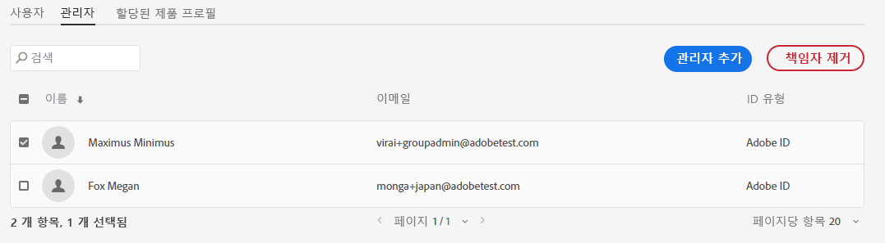

# 관리 역할

조직에서 Adobe Admin Console을 사용하면 유연한 관리 계층을 정의하여 Adobe 제품 액세스 및 사용을 세밀하게 관리할 수 있습니다. 계층 구조의 맨 위에는 기업 온보딩 프로세스 중 권한을 설정한 한 명 이상의 [시스템 관리자]가 있습니다. [시스템 관리자]는 다른 관리자에게 책임을 위임할 수 있으나, 전체적인 제어 권한은 계속 시스템 관리자가 보유합니다.

관리 역할을 설정하면 기업에는 다음과 같은 이점이 있습니다.

* 관리 책임의 분권화를 제어
* 제품 할당을 빠르게 확인(사용자별, 제품별)
* 제품 관리자에게 할당량을 할당하는 기능

## 관리 계층

적용 대상: Adobe 기업 고객.

관리 계층은 기업의 고유한 요구 사항에 맞추어 사용할 수 있습니다. 예를 들어 기업에서는 Adobe Creative Cloud와 Adobe Marketing Cloud 오퍼링에 대한 권한 관리에 서로 다른 관리자를 지정할 수 있습니다. 아니면 기업에서 서로 다른 비즈니스 단위에 속하는 사용자의 권한을 관리하는 데 서로 다른 관리자를 지정할 수도 있습니다.

>[!NOTE]
>
>관리 계층은 팀 고객에게는 적용되지 않습니다. 팀 고객에게는 단일 **시스템 관리자** 역할만 제공됩니다. 계약 소유자(_이전 이름:**기본 관리자**_)는 계약의 세부 사항 및 청구 내역에 액세스할 수 있는 시스템 관리자입니다. 현재 계약 소유자는 기존 시스템 관리자(_&#x200B;이전 이름: **보조 관리자**_)를 계약 소유자로 지정할 수 있습니다.

_관리 역할 계층_

| 역할 | 설명 |
|--- |--- |
| **시스템 관리자** | 조직의 슈퍼 사용자로, Admin Console에서 모든 관리 작업을 수행할 수 있습니다. 또한 다른 사용자에게 [제품 관리자], [제품 프로필 관리자], [사용자 그룹 관리자], [배포 관리자], [지원 관리자] 관리 기능을 위임할 수 있는 권한이 있습니다. |
| **제품 관리자** | 해당 관리자에게 할당된 제품과 관련 관리 기능 전체를 다음과 같이 관리합니다.<ul><li>제품 프로필 만들기</li><li>사용자 및 사용자 그룹을 조직에 추가(제거는 불가)</li><li>제품 프로필에 사용자 및 사용자 그룹을 추가 또는 제거</li><li>제품 프로필에 제품 프로필 관리자를 추가 또는 제거</li><li>제품에 다른 제품 관리자를 추가 또는 제거</li><li>그룹에 그룹 관리자 추가 또는 제거</li></ul> |
| **제품 프로필 관리자** | 해당 관리자에게 할당된 제품 프로필 설명과 관련 관리 기능 전체를 다음과 같이 관리합니다.<ul><li>사용자 및 사용자 그룹을 조직에 추가(제거는 불가)</li><li>제품 프로필에 사용자 및 사용자 그룹을 추가 또는 제거</li><li>제품 프로필에서 사용자 및 사용자 그룹에 대해 제품 권한 할당 또는 철회</li><li>제품 프로필에서 사용자 및 사용자 그룹의 제품 역할 관리 |
| **사용자 그룹 관리자** | 해당 관리자에게 할당된 사용자 그룹 설명과 관련 관리 기능 전체를 다음과 같이 관리합니다.<ul><li>그룹에 사용자 추가 또는 제거</li><li>그룹에 사용자 그룹 관리자 추가 또는 제거 |
| **배포 관리자** | 소프트웨어 패키지 및 업데이트를 만들고 관리하며 최종 사용자에게 배포합니다. |
| **지원 관리자** | 고객이 보고한 문제 보고서 등 지원 관련 정보에 액세스할 수 있는 비관리 역할입니다. |
| **스토리지 관리자** | 조직의 스토리지를 관리합니다. 이 관리자는 활성 사용자와 비활성 사용자 모두의 스토리지 사용량을 보고 콘텐츠를 다른 수신자에게 전송할 수 있습니다. |

각 관리 역할에 따른 권한의 자세한 목록은 [권한](#enterprise-admins-permissions-matrix)을 참조하세요.

## 기업 관리자 추가 역할 {#add-enterprise-role}

적용 대상: Adobe 기업 고객.

[위](#administrative-hierarchy)에서 설명하는 바와 같이, 관리자는 다른 사용자에게 관리 역할을 할당하여 자신과 동일한 권한을 부여하거나, 계층에서 자신의 관리 역할 아래에 있는 역할의 권한을 부여할 수 있습니다. 예를 들어 [제품 관리자]는 사용자에게 [제품 관리자] 권한 또는 [제품 프로필 관리자] 권한을 부여할 수 있지만, [배포 관리자]권한은 부여할 수 없습니다. Admin Console의 권한에 대해서는 [권한 매트릭스](#enterprise-admins-permissions-matrix)를 참조하세요.

관리자를 추가하거나 초대하는 방법:

1. [Admin Console](https://adminconsole.adobe.com/)에서 **사용자** > **관리자**&#x200B;를 선택합니다.

   또는 관련 [제품], [제품 프로필] 또는 [사용자 그룹]에서 **관리자** 탭으로 이동합니다.

1. **관리자 추가**&#x200B;를 클릭합니다.
1. 이름 또는 이메일 주소를 입력합니다. 기존 사용자를 검색하거나, 유효한 이메일 주소를 지정하고 화면에 정보를 입력하여 새 사용자를 추가할 수 있습니다.
1. **다음**&#x200B;을 클릭합니다. 관리 역할 목록이 표시됩니다.

>[!NOTE]
>
>* 이 화면의 옵션은 사용자의 계정 및 관리 역할에 따라 다릅니다. 보유하고 있는 것과 동일한 권한을 부여하거나 계층에서 자신의 아래에 있는 역할의 권한을 부여할 수 있습니다.
>* 팀의 [시스템 관리자]는 [시스템 관리자] 관리 역할만 할당할 수 있습니다.

1. 관리 역할을 하나 이상 선택합니다.
1. [제품 관리자], [제품 프로필 관리자], [사용자 그룹 관리자] 등 관리자 유형마다 각각 특정 제품, 프로필, 그룹을 선택합니다.

>[!NOTE]
>
>[제품 프로필 관리자]의 경우 두 개 이상의 제품에 대한 프로필을 포함할 수 있습니다.

1. 선택한 사용자에게 할당한 관리 역할을 검토하고 **저장**&#x200B;을 클릭합니다.

해당 사용자는 `message@adobe.com` 주소로 새 관리 권한에 대한 초대 이메일을 받게 됩니다.

사용자가 조직에 참여하려면 이메일에서 **시작**&#x200B;을 클릭해야 합니다. 새 관리자가 초대 이메일의 **시작** 링크를 사용하지 않은 경우 Admin Console에 로그인할 수 없습니다.

로그인 프로세스의 일부로, 아직 Adobe 프로필이 없는 사용자의 경우 프로필 설정을 요청받을 수 있습니다. 사용자의 이메일 주소와 연결된 프로필이 여러 개 있는 경우, 해당 사용자는 [팀 가입]을 선택(메시지가 표시된 경우)한 다음 새 조직과 연결할 프로필을 선택해야 합니다.

## 팀 관리자 추가 {#add-admin-teams}

적용 대상: Adobe 팀 고객.

관리자는 [시스템 관리자] 역할을 다른 사용자에게 할당하여 자신과 동일한 권한을 부여할 수 있습니다.

시스템 관리자를 추가하거나 초대하는 방법:

1. Admin Console에서 **사용자** > **관리자**&#x200B;를 선택합니다.

   기존 관리자 목록이 표시됩니다.

1. **관리자 추가**&#x200B;를 클릭합니다.

   **관리자 추가** 화면이 표시됩니다.

1. 이름 또는 이메일 주소를 입력합니다. 기존 사용자를 검색하거나, 유효한 이메일 주소를 지정하고 화면에 정보를 입력하여 새 사용자를 추가할 수 있습니다.

   기본적으로 [시스템 관리자]가 선택되어 있습니다.

1. **저장**&#x200B;을 클릭합니다.

팀 조직의 모든 사용자는 비즈니스 ID 사용자이므로, `message@adobe.com` 주소로 새로운 관리 권한에 대한 이메일 초대를 받습니다.
사용자가 조직에 참여하려면 이메일에서 [시작]을 클릭해야 합니다.

로그인 프로세스의 일부로, 아직 Adobe 프로필이 없는 사용자의 경우 프로필 설정을 요청받을 수 있습니다. 사용자의 이메일 주소와 연결된 프로필이 여러 개 있는 경우, 해당 사용자는 [팀 가입]을 선택(메시지가 표시된 경우)한 다음 새 조직과 연결할 프로필을 선택해야 합니다.

## 기업 관리 역할 편집

적용 대상: Adobe 기업 고객.

관리자는 관리 계층에서 자신보다 아래에 있는 다른 관리자의 관리 역할을 편집할 수 있습니다. 예를 들어 다른 관리자의 관리 권한을 제거할 수도 있습니다.

관리 역할 편집 방법:

1. Admin Console에서 **사용자** > **관리자**&#x200B;를 선택합니다. 기존 관리자 목록이 표시됩니다.

   또는 관련 [제품], [제품 프로필] 또는 [사용자 그룹]에서 **관리자** 탭으로 이동합니다.

1. 편집할 관리자의 이름을 클릭합니다.
1. **사용자 세부 정보**&#x200B;에서 을 클릭하여 **관리 권한** 섹션으로 이동한 다음 **관리 권한 편집**&#x200B;을 선택합니다.

   

1. 관리 권한을 편집하고 변경 사항을 저장합니다.

## 팀 관리 역할 편집

적용 대상: Adobe 팀 고객.

팀의 [시스템 관리자]는 다른 관리자의 [시스템 관리자] 권한을 제거할 수 있습니다.

시스템 관리자 권한을 철회하는 방법:

1. Admin Console에서 **사용자** > **관리자**&#x200B;를 선택합니다.

   기존 관리자 목록이 표시됩니다.

1. [사용자 세부 정보]에서 **관리 권한** 섹션 오른쪽의 을 클릭하고 **관리 권한 편집**&#x200B;을 선택합니다.

   

1. 관리 권한을 편집하고 변경 사항을 저장합니다.

## 관리자 제거

적용 대상: Adobe 팀, 기업 고객.

1. 관리자 권한을 철회하려면 사용자를 선택한 다음 **관리자 제거**&#x200B;를 클릭합니다.

>[!NOTE]
>
>관리자를 제거해도 Admin Console에서 사용자가 삭제되지는 않고, 관리 역할과 연결된 권한만 제거됩니다.

## 기업 관리자 권한 매트릭스

적용 대상: Adobe 기업 고객.

다음 표에서는 다양한 관리자 유형에 따른 권한 전체의 목록을 다음 기능 영역으로 분류합니다.

### 신원 관리

| 권한 | 시스템 관리자 | 지원 관리자 |
|--- |--- |--- |
| 도메인 추가(도메인 요청) | ✔ |  |
| 도메인 및 도메인 목록 보기 | ✔ |  |
| 도메인 암호화 키 관리 | ✔ |  |
| 기본 조직 암호 정책 관리 | ✔ |  |
| 기본 조직 암호 정책 보기 | ✔ |  |

### 사용자 관리

| 권한 | 시스템 관리자 | 지원 관리자 |
|--- |--- |--- |
| 조직에 사용자 추가 | ✔ |  |
| 조직에서 사용자 제거 | ✔ |  |
| 사용자 세부 정보 및 목록 보기 | ✔ |  |
| 사용자 프로필 편집 | ✔ |  |
| 사용자 또는 그룹에 제품 프로필 추가 | ✔ |  |
| 사용자 또는 그룹에서 제품 프로필 제거 | ✔ |  |
| 여러 사용자에게 제품 프로필 추가 | ✔ |  |
| 사용자의 제품 프로필 보기 | ✔ |  |
| 제품 사용자 목록 보기 | ✔ |  |
| 사용자를 조직에 일괄 추가 | ✔ |  |

### 관리자 관리

| 권한 | 시스템 관리자 | 지원 관리자 |
|--- |--- |--- |
| 사용자에게 조직 관리 권한 부여 | ✔ |  |
| 사용자의 조직 관리 권한 철회 | ✔ |  |
| 사용자에게 제품 라이선스 관리 권한 부여 | ✔ |  |
| 사용자의 제품 라이선스 관리 권한 철회 | ✔ |  |
| 사용자에게 배포 관리 권한 부여 | ✔ |  |
| 사용자의 배포 관리 권한 철회 | ✔ |  |
| 사용자에게 사용자 그룹 관리 권한 부여 | ✔ |  |
| 사용자의 사용자 그룹 관리 권한 철회 | ✔ |  |
| 사용자에게 제품 소유자 관리 권한 부여 | ✔ |  |
| 사용자의 제품 소유자 관리 권한 철회 | ✔ |  |

### 제품 라이선스 구성 관리

| 권한 | 시스템 관리자 | 지원 관리자 |
|--- |--- |--- |
| 조직에 제품 권한 부여 |  |  |
| 조직의 제품 권한 제거 |  |  |
| 조직에서 소유한 총 라이선스 수 보기 | ✔ |  |
| 사용 가능한 제품 및 제품군 보기 | ✔ |  |
| 제품 라이선스 설명/데이터 편집 | ✔ |  |
| 사용자에게 제품 라이선스 제공 | ✔ |  |
| 사용자의 제품 라이선스 사용권 철회 | ✔ |  |
| 새 제품 라이선스 구성 추가 | ✔ |  |
| 제품 라이선스 서비스 구성 편집 | ✔ |  |
| 제품 라이선스 서비스 구성 삭제 | ✔ |  |
| 사용자의 제품 액세스 제거(모든 구성에서 제거) | ✔ |  |

### 스토리지 관리

| 권한 | 시스템 관리자 | 지원 관리자 |
|--- |--- |--- |
| 활성 및 비활성 사용자 폴더 보기 | ✔ |  |
| 비활성 사용자 폴더 삭제 및 콘텐츠 전송 | ✔ |  |

### 배포

| 권한 | 시스템 관리자 | 지원 관리자 |
|--- |--- |--- |
| 패키지 탭 보기/사용 | ✔ |  |

### 지원

| 권한 | 시스템 관리자 | 지원 관리자 |
|--- |--- |--- |
| 지원 탭 보기 | ✔ |  |
| 지원 사례 관리 | ✔ | ✔ |

### 사용자 그룹 관리

| 권한 | 시스템 관리자 | 지원 관리자 |
|--- |--- |--- |
| 사용자 그룹 만들기 | ✔ |  |
| 사용자 그룹 제거 | ✔ |  |
| 사용자 그룹에 사용자 추가 | ✔ |  |
| 사용자 그룹에서 사용자 제거 | ✔ |  |
| 제품 라이선스에 사용자 그룹 할당 | ✔ |  |
| 제품 라이선스에서 사용자 그룹 제거 | ✔ |  |
| 사용자 그룹의 구성원 보기 | ✔ | ✔ |
| 사용자 그룹 목록 보기 | ✔ | ✔ |
