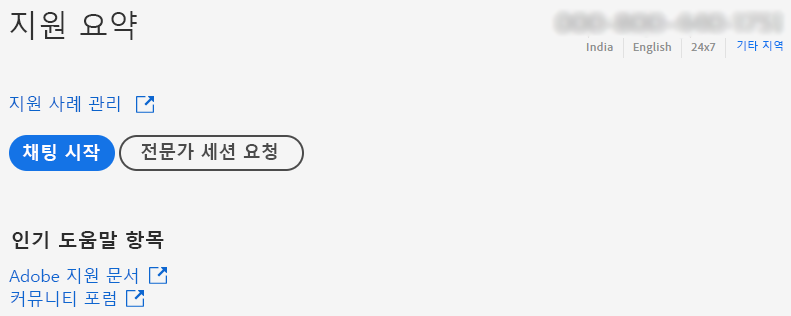
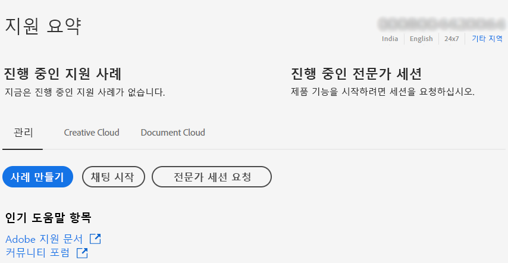
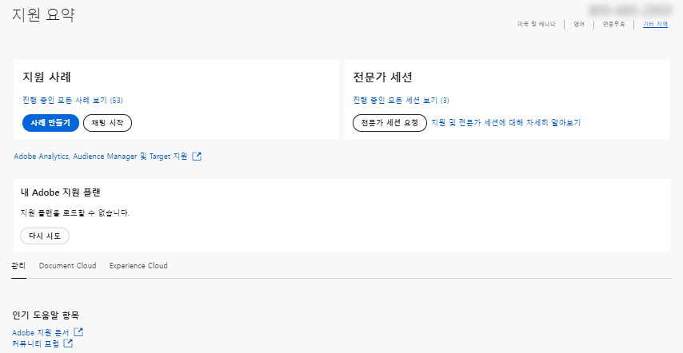

# 기업 및 팀 | Adobe 고객 지원 센터 문의

Adobe 고객 지원 센터에 문의하려면 [Admin Console](https://adminconsole.adobe.com/)의 **지원** 탭으로 이동합니다.

[Admin Console](https://adminconsole.adobe.com/)의 **지원 탭**&#x200B;에서 간단하고 사용하기 쉬운 인터페이스를 통해 다양한 지원 옵션에 액세스할 수 있습니다. [지원] 탭의 옵션은 사용하는 구독 플랜에 따라 다릅니다. 자세한 내용을 보려면 사용하는 구독 플랜에 해당하는 **자세히 알아보기**&#x200B;를 클릭하세요.

어떤 구독 플랜을 사용하는지 잘 모르는 경우 [Admin Console](https://adminconsole.adobe.com/)의 **지원 탭**&#x200B;으로 이동하여 아래의 이미지와 보기를 비교합니다. 그 다음 해당하는 **자세히 알아보기** 링크를 클릭합니다.

## 팀 계정의 경우

<!--
[Learn more](https://helpx.adobe.com/enterprise/using/support-for-teams.html)
-->

## 기업 계정의 경우

<!--
[Learn more](https://helpx.adobe.com/enterprise/using/support-for-enterprise.html)
-->

## Experience Cloud의 경우

<!--
[Learn more](https://www.adobe.com/go/ac_ec_not_supported_en)
-->
