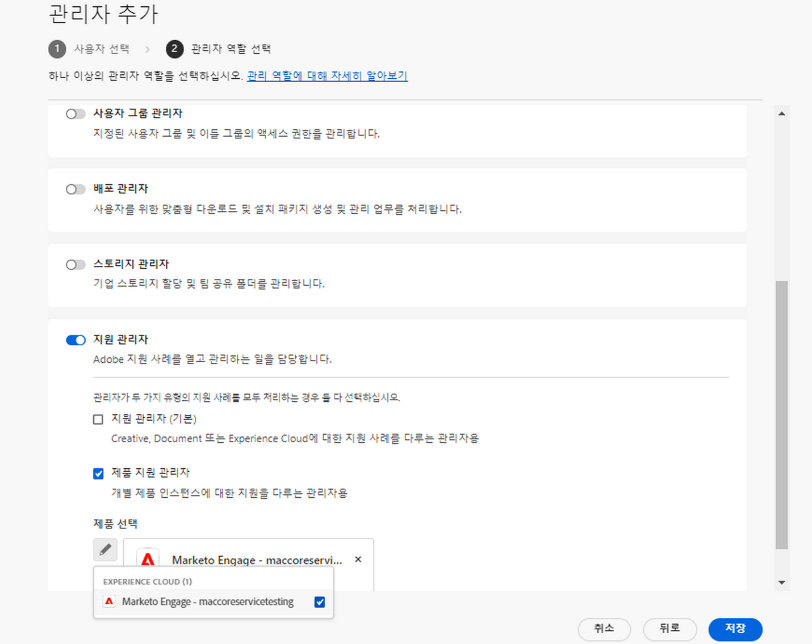

# Adobe 고객 지원 경험

## Admin Console 지원 티켓

이제 [Admin Console](https://adminconsole.adobe.com/)을 통해 지원 티켓을 제출할 수 있습니다. 지원 티켓을 제출하는 방법에 대한 안내는 [지원 티켓 제출](#submit-ticket) 섹션에서 확인하세요.

Adobe는 고객 지원과 상호 작용하는 방법을 개선하기 위해 노력하고 있습니다. Adobe의 목표는 Adobe Admin Console을 통해 단일 입력 포털로 전환하여 지원 환경을 간소화하는 것입니다. 변경 사항이 적용되면 조직은 Adobe 고객 지원 센터에 쉽게 액세스하고 공통 시스템을 통해 여러 제품의 서비스 기록을 더욱 정확하게 파악할 수 있으며, 단일 포털을 통해 전화, 웹 및 채팅으로 도움을 요청할 수 있습니다.

## Admin Console 지원 티켓을 제출하는 방법 {#submit-ticket}

[Admin Console](https://adminconsole.adobe.com/)에서 지원 티켓을 제출하려면 시스템 관리자가 할당한 지원 관리자 역할이 있어야 합니다. 이 역할은 조직의 시스템 관리자만이 할당할 수 있습니다. 제품, 제품 프로필 및 기타 관리자 역할은 지원 관리자 역할을 할당할 수 없으며, 지원 티켓 제출에 사용하는 **[!UICONTROL 사례 만들기]** 옵션을 볼 수 없습니다. 자세한 내용은 [엔터프라이즈 및 팀 고객 지원 센터](customer-care.md) 설명서를 참조하세요.

### 지원 관리자 역할 할당

지원 관리자 역할은 관리자가 아닌 역할이지만 지원 관련 정보에 액세스할 수 있습니다. 지원 관리자는 문제 보고서를 보고 만들고 관리할 수 있습니다.

관리자를 추가하거나 초대하는 방법:

1. Admin Console에서 **[!UICONTROL 사용자]** > **[!UICONTROL 관리자]**&#x200B;를 선택합니다.
1. **[!UICONTROL 관리자 추가]**&#x200B;를 클릭합니다.
1. 이름 또는 이메일 주소를 입력합니다.

   기존 사용자를 검색하거나 유효한 이메일 주소를 지정하고 화면에 정보를 입력하여 새 사용자를 추가할 수 있습니다.

   

1. **[!UICONTROL 다음]**&#x200B;을 클릭합니다. 관리 역할 목록이 표시됩니다.

사용자에게 지원 관리자 역할을 할당하는 방법(사용자가 지원에 문의할 수 있도록 활성화):

1. **[!UICONTROL 지원 관리자]** 옵션을 선택합니다.

   

1. 다음 두 옵션 중 하나를 선택합니다.

   * 옵션 1: **[!UICONTROL 기본 지원 관리자]**. 사용자에게 모든 솔루션(Marketo Engage 제외)에 대한 액세스 권한을 부여하려면 이 옵션을 선택합니다.
   * 옵션 2: **[!UICONTROL 제품 지원 관리자]**: Marketo Engage 지원을 위해 이 옵션을 선택합니다. 사용자에게 액세스 권한을 부여할 Marketo Engage 인스턴스를 선택합니다.

   

1. 선택을 완료했으면 **[!UICONTROL 저장]**&#x200B;을 클릭합니다.

해당 사용자는 `message@adobe.com` 주소로 새 관리 권한에 대한 초대 이메일을 받게 됩니다.

사용자가 조직에 참여하려면 이메일에서 **시작**&#x200B;을 클릭해야 합니다. 새 관리자가 초대 이메일의 **시작** 링크를 사용하지 않은 경우 Admin Console에 로그인할 수 없습니다.

로그인 프로세스의 일부로, 아직 Adobe 프로필이 없는 사용자의 경우 프로필 설정을 요청받을 수 있습니다. 사용자의 이메일 주소와 연결된 프로필이 여러 개 있는 경우, 해당 사용자는 **팀 가입**(메시지가 표시된 경우)을 선택한 다음 새 조직과 연결할 프로필을 선택해야 합니다.

자세한 내용은 관리자 역할 설명서의 [기업 관리자 역할 편집](admin-roles.md#add-enterprise-role) 지침을 따르세요. 참고: 이 역할은 조직의 시스템 관리자만이 할당할 수 있습니다. 관리자의 계층에 대한 자세한 내용은 [관리자 역할](admin-roles.md) 설명서를 참조하세요.

### Admin Console로 지원 티켓 만들기

[Admin Console](https://adminconsole.adobe.com/)을 사용하여 티켓을 만들려면 상단의 탐색 목록에 있는 **[!UICONTROL 지원]** 탭을 선택합니다. [!UICONTROL 지원 요약] 페이지가 나타납니다. 다음으로, **[!UICONTROL 사례 만들기]** 옵션을 선택합니다.

>[!TIP]
>
> **[!UICONTROL 사례 만들기]** 옵션 또는 **[!UICONTROL 지원]** 탭이 보이지 않는다면 시스템 관리자에게 문의하여 지원 관리자 역할 할당을 요청해야 합니다.

문제 유형을 선택할 수 있는 대화 상자가 나타납니다. 가지고 있는 문제나 문의 사항에 가장 적합한 문제 유형을 선택한 다음 오른쪽 하단의 **[!UICONTROL 사례 만들기]**&#x200B;를 선택합니다.

**[!UICONTROL 사례 만들기]** 대화 상자가 나타납니다. 대화 상자의 요청에 따라 제품, 우선 순위, 설명 등의 일부 정보를 입력하고 문제를 설명하는 데 도움이 되는 스크린샷이 있다면 첨부합니다. **[!UICONTROL 다음]**&#x200B;을 선택하여 계속합니다.

>[!NOTE]
>
> 문제로 인해 생산 시스템의 가동이 중단되거나 극도로 심각한 고장이 발생한 경우, 제공되는 전화번호로 연락하여 즉시 도움을 받을 수 있습니다.

다음 페이지에서는 연락처 정보와 Adobe 고객 지원 센터의 연락을 받을 수 있는 시간을 입력할 수 있습니다. 입력을 완료하고 오른쪽 하단의 **[!UICONTROL 제출]**&#x200B;을 선택하면 티켓을 Adobe 고객 지원 센터에 전송합니다.

<!--

## What About the Legacy Systems?

New Tickets/Cases will no longer be able to be submitted in legacy systems as of May 11th.  The [Admin Console](https://adminconsole.adobe.com/) will be used to submit new tickets/cases.

### Existing Tickets/Cases

* Between May 11th and May 20th the legacy systems will remain available to work existing tickets/cases to completion.
* Beginning May 20th the support team will migrate remaining open cases from the legacy systems to the new support experience.  You will receive an email notification regarding how to contact support to continue to work these cases.
-->
