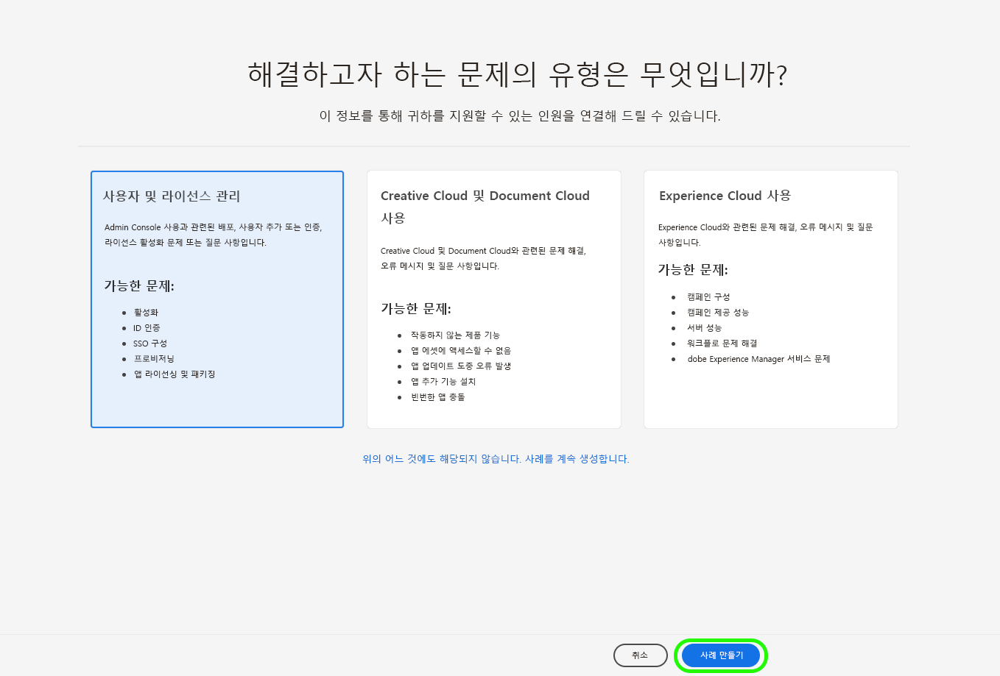

# Adobe 고객 지원 경험

## Admin Console 지원 티켓

이제 를 통해 지원 티켓을 제출할 수 있습니다. [Admin Console](https://adminconsole.adobe.com/). 지원 티켓을 제출하는 방법에 대한 지침은 [지원 티켓 제출](#submit-ticket).

Adobe는 Adobe 고객 지원과 상호 작용하는 방법을 개선하기 위해 노력하고 있습니다. Adobe의 목표는 Adobe Admin Console을 사용하여 단일 입력 포털로 전환하여 지원 환경을 간소화하는 것입니다. 변경 사항이 적용되면 조직은 Adobe 고객 지원 센터에 쉽게 액세스할 수 있습니다. 여러 제품의 공통 시스템을 통해 서비스 기록을 더욱 정확하게 파악할 수 있습니다. 또한 단일 포털을 통해 전화, 웹 및 채팅으로 도움을 요청할 수 있습니다.

## Admin Console 지원 티켓을 제출하는 방법 {#submit-ticket}

지원 티켓을 제출하려면 다음을 수행하십시오. [Admin Console](https://adminconsole.adobe.com/)를 지정하는 경우 시스템 관리자가 지원 관리자 역할을 할당해야 합니다. 조직의 시스템 관리자만 이 역할을 할당할 수 있습니다. 제품, 제품 프로필 및 기타 관리 역할은 지원 관리자 역할을 할당할 수 없으며 **[!UICONTROL 사례 만들기]** 지원 티켓을 제출하는 데 사용되는 옵션입니다. 자세한 내용은 [엔터프라이즈 및 팀 고객 지원](customer-care.md) 설명서.

### 지원 관리자 역할 할당

지원 관리자 역할은 지원 관련 정보에 액세스할 수 있는 관리자가 아닌 역할입니다. 지원 관리자는 문제 보고서를 보고, 만들고, 관리할 수 있습니다.

지원 관리자 역할을 할당하려면 [enterprise admin 역할 편집](admin-roles.md#add-enterprise-role) 관리 역할 설명서의 지침 조직의 시스템 관리자만 이 역할을 할당할 수 있습니다. 관리 계층에 대한 자세한 내용은 [관리자 역할](admin-roles.md) 설명서.

### Admin Console으로 지원 티켓 만들기

를 사용하여 티켓을 만들려면 [Admin Console](https://adminconsole.adobe.com/)에서 을(를) 선택합니다. **[!UICONTROL 지원]** 위쪽 탐색에 있는 탭입니다. 다음 [!UICONTROL 지원 요약] 페이지가 나타납니다. 다음으로, **[!UICONTROL 사례 만들기]** 선택 사항입니다.

>[!TIP]
>
> 다음을 볼 수 없는 경우 **[!UICONTROL 사례 만들기]** 옵션 또는 **[!UICONTROL 지원]** 탭에서 시스템 관리자에게 문의하여 지원 관리자 역할을 할당해야 합니다.

문제 유형을 선택할 수 있는 대화 상자가 나타납니다. 문제나 질문을 가장 잘 설명하는 문제 유형을 선택한 다음 **[!UICONTROL 사례 만들기]** 오른쪽 아래에 있습니다.

다음 **[!UICONTROL 사례 만들기]** 대화 상자가 나타납니다. 제품, 우선 순위, 설명 등의 일부 정보를 제공하고 스크린샷을 첨부하여 문제를 설명하는 데 도움이 되도록 합니다. 선택 **[!UICONTROL 다음]** 계속하십시오.

>[!NOTE]
>
> 이 문제로 인해 생산 시스템이 가동 중단되거나 극도로 심각한 중단이 발생할 경우, 즉시 지원을 받을 수 있는 전화 번호가 제공된다.

다음 페이지에서는 연락처 정보를 입력하고 고객 지원 Adobe이 연락할 수 있는 최적의 시간을 제공할 수 있습니다. 완료되면 을 선택합니다 **[!UICONTROL 제출]** 오른쪽 아래에서 티켓을 Adobe 고객 지원 센터에 전송합니다.

<!--

## What About the Legacy Systems?

New Tickets/Cases will no longer be able to be submitted in legacy systems as of May 11th.  The [Admin Console](https://adminconsole.adobe.com/) will be used to submit new tickets/cases.

### Existing Tickets/Cases

* Between May 11th and May 20th the legacy systems will remain available to work existing tickets/cases to completion.
* Beginning May 20th the support team will migrate remaining open cases from the legacy systems to the new support experience.  You will receive an email notification regarding how to contact support to continue to work these cases.
-->
