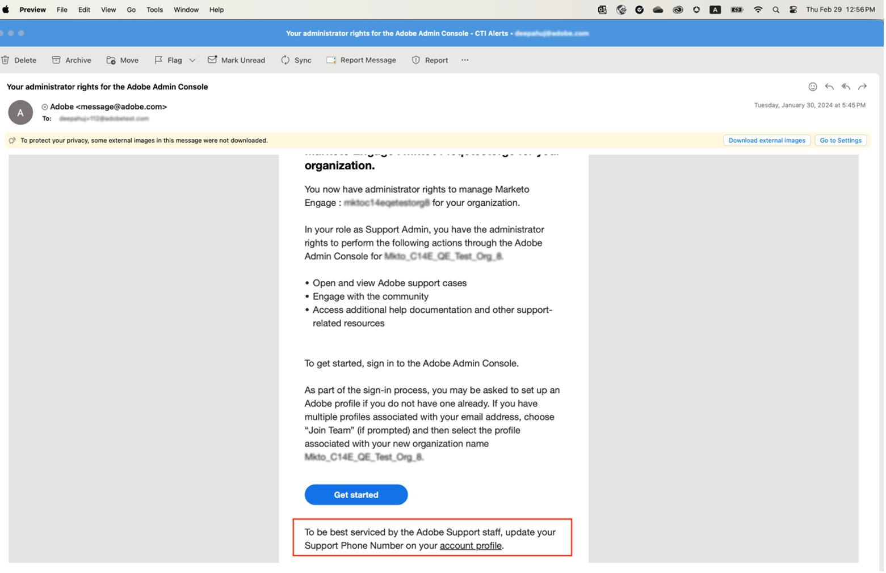
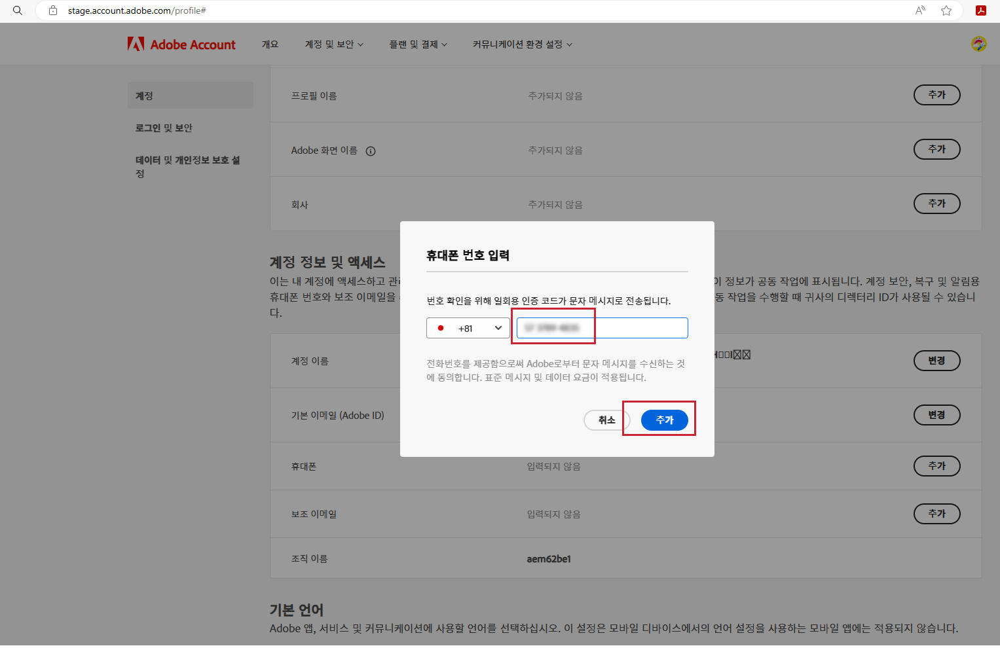

# 기본 지원 전화 번호 지정

&#39;제품 지원 관리자&#39;와 같은 &#39;관리&#39; 역할이 할당되면 관리자 권한이 부여된 인스턴스를 관리할 수 있는 &#39;관리자&#39; 권한이 있음을 알리는 이메일을 받게 됩니다.

이제 이메일에는 계정 프로필로 이동하여 기본 지원 전화 번호를 공유하는 방법을 설명하는 아래 빨간색 텍스트가 포함됩니다.

기본 전화 번호를 지정하려면:

1. `account.adobe.com`를 사용해 로그인하려면 **계정 프로필**&#x200B;을 클릭하여 새 창을 엽니다.

   

1. 로그인 프로세스를 수행한 후 `account.adobe.com`의 아래 화면으로 이동합니다.
1. 그런 다음 아래 계정 및 보안 > 계정 탭을 클릭하여 지원 전화 번호 필드를 확인합니다.
1. 귀하의 지원 요구 사항에 대해 귀하를 인식하는 데 사용할 전화 번호를 여기에 추가합니다.

